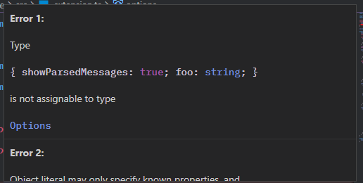

# Better TS Errors 🧼

A Visual Studio Code extension used for parsing and formatting TypeScript error messages.

Simply enable the `better-ts-errors` extension in your VSCode and hover a TS error to see the magic happening 🌠

## Preview

You can also preview how the parsing works in the [web application](https://better-ts-errors.vercel.app/).

## Additional Information

- Extension icon by [Freepik](https://www.flaticon.com/authors/freepik)